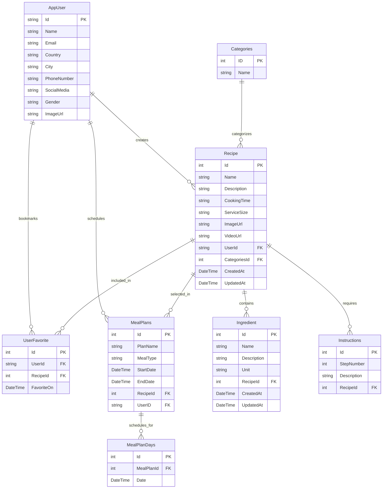

# FoodRecipe Integrated Workspace: System Design & Architecture Analysis

This document provides a comprehensive analysis of the system architecture, design patterns, core features, and technical details of the **FoodRecipe** application workspace.

---

## 1. System Overview & Technology Stack

The project is structured as an integrated multi-tier workspace orchestrating three primary components:

*   **Backend (API)**: ASP.NET Core Web API built with .NET 8.0, exposing RESTful endpoints. It leverages Entity Framework Core (EF Core) for object-relational mapping, ASP.NET Core Identity for user management, and JWT Bearer tokens for secure stateless authentication.
*   **Frontend (React)**: Single Page Application (SPA) built using React, TypeScript, and React Router. State management and API caching are driven by Redux Toolkit and Redux Toolkit Query (RTK Query), and UI layouts are powered by Bootstrap and RSuite.
*   **Database**: MySQL 8.0 instance containerized via Docker Compose, storing relational application data.

### Workspace Orchestration
The root workspace coordinates scripts using `npm` and `concurrently` to spin up services:
*   `npm run install:all`: Dual-install for root orchestration and frontend packages.
*   `npm run db:up`: Boots the MySQL database container.
*   `npm run dev`: Parallelized boot-up of database container, ASP.NET API development server, and React dev server.

---

## 2. Database Design & Entity Relationships

The relational schema is configured in `ApplicationDbContext` and mapped to MySQL using Entity Framework Core. Below is a visual representation of the core data models and their associations:

### Key Relational Features
*   **Hierarchical Recipes**: A `Recipe` aggregates multiple `Ingredient` and `Instructions` (steps) entities, which are updated/created cascadingly.
*   **User Preferences**: Many-to-many join relationship managed by `UserFavorite` mapping users to bookmark-able recipes.
*   **Meal Scheduling**: `MealPlans` holds metadata (meal type: Breakfast/Lunch/Dinner) which binds to daily instances via `MealPlanDays` mapping specific dates.
*   **Seeded Data**: Default categories are seeded during migrations: *Dessert, Brunch, Breakfast, Dinner, Lunch, Snack*.

---

## 3. Backend Architecture Details

The API follows a Clean Web API pattern focusing on Controllers, Services, and Data contexts:

### Core Layers and Services
1.  **Identity & Security (`AuthController`)**:
    *   Integrates ASP.NET Core Identity with `AppUser` extending the base `IdentityUser`.
    *   Implements role-based permissions (`Admin` and `User` roles auto-seeded on initial user register request).
    *   Generates 7-day expiration JWT tokens signed via a symmetric secret key.
    *   Implements a Forgot/Reset Password flow using Base64Url-encoded tokens mailed through `IEmailSender`.
2.  **Image Upload Service (`IImageService` / `CloudinaryService`)**:
    *   Allows image files (avatars, recipe covers) uploaded to the API to be stored on **Cloudinary**, returning hosted URLs.
3.  **Entity Controllers**:
    *   `RecipeController`: CRUD handler supporting transaction-based cascading deletes and dynamic list diffing on recipe updates.
    *   `FavoriteController`: Features paginated lists of user favorites and batch synchronization.
    *   `UserController`: Handles user detail retrieval and profile modifications.
    *   `MealPlanController`: Schedules and retrieves user menus.

---

## 4. Frontend Architecture Details

The React client utilizes modern state, router, and page structure designs:

### Client-Side Architecture Flow
*   **Routing & Guards**: Routes in `App.tsx` handle redirects. Route protection is handled via Higher Order Components:
    *   `withAuth.tsx`: Restricts guest access.
    *   `withAuthAdmin.tsx`: Restricts admin-only pages (e.g., adding/editing recipes).
*   **State Management (Redux & RTK Query)**:
    *   RTK Query modules (`recipeApi`, `authApi`, `favoriteApi`, `userApi`) handle caching, invalidating tags (such as `["Recipes"]` to trigger re-fetches upon additions/updates), and base queries pointing to the local ASP.NET server.
    *   Local variables (like authentication token and active user identity) are stored globally via `userAuthSlice` and decoded via `jwt-decode` on load.
*   **Batch Synchronization Strategy (Favorites)**:
    *   In the `ProductCatalog.tsx` screen, when a user likes/unlikes recipes, instead of spamming individual REST requests, the application updates the React state locally and schedules a **deferred sync** back to the server. The state is synced every 3 minutes, on pagination page changes, and on page unload events.

---

## 5. Core Application Features

The workspace offers the following functional modules:

| Module | Features Provided | Implementation Status |
| :--- | :--- | :--- |
| **Authentication** | Registration (User/Admin roles), Login (JWT token cache in LocalStorage), Forgot Password (Email links), Reset Password. | Fully Functional |
| **Recipe Catalog** | Dynamic paginated list of recipes with cover photos, description, and cooking times. | Fully Functional |
| **Recipe Management** | Form with dynamic fields to add/remove ingredients and steps. Base64 file reader to local preview, image size/type validation, and Cloudinary uploads. | Fully Functional (Admin only) |
| **Favorites System** | Mark recipes as favorite. Paginated view of favorite items. Deferred batch sync to MySQL database. | Fully Functional |
| **Meal Planner** | Weekly navigation, calendar day selector, meal type categorization (Breakfast, Lunch, Dinner), add/remove meals, owner-scoped delete, date-range query, and duplicate-meal prevention (same recipe + day + meal type). | Fully Functional |

---

## 6. Code Quality Observations & Recommendations (Resolved)

1.  **Resolved: Incorrect Delete Query on Meal Plans**
    *   Updated `MealPlanController.cs` to execute `_ctx.MealPlans.Remove(rmMealPlan)` and `await _ctx.SaveChangesAsync()` properly when removing a meal plan by recipe ID.
2.  **Resolved: Synchronous Blocking on Async DB Calls**
    *   Updated `UserController.cs` to correctly await `FirstOrDefaultAsync` on user fetching, replacing all blocking synchronous `user.Result` calls with direct `user` object access. Also transitioned `SaveChanges()` to `SaveChangesAsync()`.
3.  **Resolved: Minor Typo in File Name**
    *   Renamed `ReceipeDTO.cs` to `RecipeDTO.cs` and resolved the typo in the API `CreateReceipe` controller action to `CreateRecipe`.
